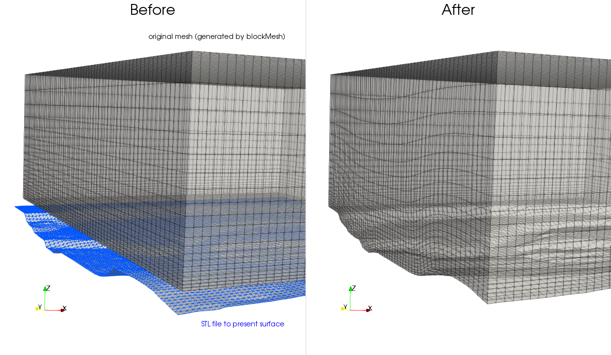
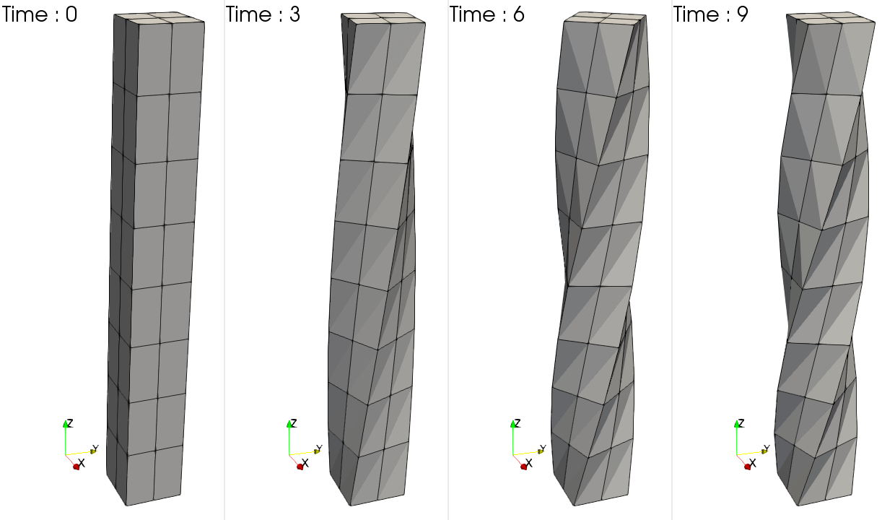

# moveDynamicMesh

## 概要

　移動メッシュのdry-runとして使用できます。
dynamicMeshDictに記載されている動きを実行します。

## 用途

- 移動メッシュの動作確認
- メッシュの変形
- メッシュの歪の緩和
 
## チュートリアル

- [SnakeRiverCanyon](tutorials/SnakeRiverCanyon) : 地形ファイルに沿ったプロジェクション

- [relativeMotion](tutorials/relativeMotion) : 回転体の中で回転するメッシュ

- [stingColumn](tutorials/twistingColumn) : ねじれる棒


## 設定ファイル

- 0/pointDisplacement : 境界面の点の制御を行います。[例](tutorials/SnakeRiverCanyon/0/pointDisplacement)
- 0/cellDisplacement : 
- constant/dynamicMeshDict : motionSolverを設定します。[例](tutorials/relativeMotion/constant/dynamicMeshDict)

## 基本コマンド

```
$ moveDynamicMesh
```

## options

- `-overwrite` : const/polyMesh/pointsを移動したpointsで上書きします。
- `-region` : マルチリージョン用に分割された領域のうち一つを指定します。
- `-checkAMI` : AMI接続された面の重みをvtkファイルで出力します。

## 注意

- 動作確認として使用する場合にはtimeStepに注意してください。
- 移動後の時刻ディレクトリにはpointsのみが保存されます。移動したメッシュを他の計算で使用する場合には`const/polyMesh`の中のpointsを時刻ディレクトリのpointsで書き換えるか`-overwrite`オプションを使用します。

## Source

- [moveDynamicMesh.C](moveDynamicMesh.C) : 


## Discription from [moveDynamicMesh.C](moveDynamicMesh.C)

```
Description
    Mesh motion and topological mesh changes utility.


```

