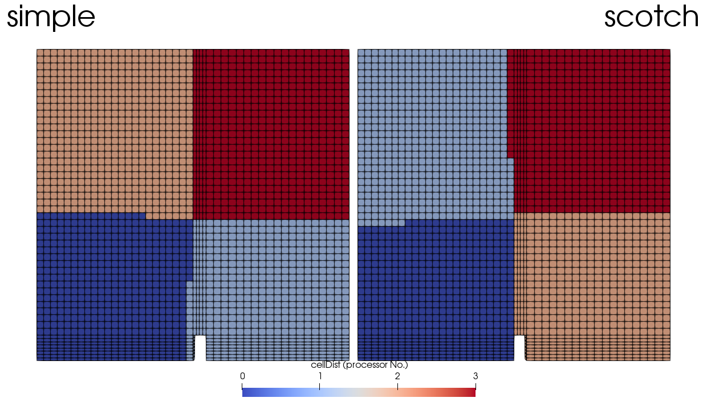

# decomposePar

## 概要

　OpenFOAMでは並列計算を行うためにメッシュやFieldを事前に分割する必要があり、その分割を行うためのユーティリティがこのdecomposeParです。
分割に関する設定は`system/decomposeParDict`に以下のように記載します。

## 用途

- 並列計算前のセルの分割

## チュートリアル

- [damBreak](tutorials/damBreak) : ダムブレークケースの分割



## 設定ファイル

- system/decomposeParDict

### decomposeParDictの基本設定

```
FoamFile // ヘッダ
{
    version     2.0;
    format      ascii;
    class       dictionary;
    object      decomposeParDict;
}

numberOfSubdomains 2; // 分割数

method          simple; // 分割手法

coeffs
{
    n           (2 1 1); // 各方向の分割数
}

```

- numberOfSubdomains : 計算の分割数です。CPUの数に応じた数字を入力します。
- method : 分割手法です。simple/hierarchical/scotch/manualなどの中から選択します。
- coeff : method:simpleの場合の設定です。nには各方向の分割数を指定します。各値の積が総分割数と一致する必要があります。 

### decomposeParの基本実行

```
decomposePar
```

## options

- `-cellDist` : 分割番号をフィールドとして出力します。ParaViewなどでどう分割されているかを確認できます。
- `-dry-run` : 実際に分割は行いません。`-cellDist`と組み合わせて使用します。
- `-time` : 時刻を指定します。例：`-time ':10,20'`->「10までと20」
- `-latestTime`最新時刻のみを分割します。
- `-fields` : 分割するフィールドを指定します。例：`-fields '(U p)'`
- `-region` :  (multiRegion) 指定した領域について分割します。例：`-region '(leftSolid heater)'`
- `-allRegions` : (multiRegion) すべての領域について分割します。
- `-ifRequired` : 分割数が変更されている場合のみ分割を行います。
- `-force` : すでに分割してあっても強制的に分割を行います。
- `-constant` : constantディレクトリの中身を各processorにコピーします。
- `-noSets` : *cellSets*, *faceSets*, *pointSets*については分割しません。
- `-copyUniform` : *time/uniform*を*processorx*にコピーします。
- `-copyZero` : *0*ディレクトリの中身を分割せずに*processorx*にただコピーします。

## Source

- [decomposePar.C](decomposePar.C) : 
- [domainDecompositionMesh.C](domainDecompositionMesh.C) : 
- [pointFieldDecomposer.C](pointFieldDecomposer.C) : 
- [readFields.C](readFields.C) : 
- [domainDecompositionDryRun.C](domainDecompositionDryRun.C) : 
- [domainDecompositionTemplates.C](domainDecompositionTemplates.C) : 
- [lagrangianFieldDecomposer.C](lagrangianFieldDecomposer.C) : 
- [faMeshDecomposition.C](faMeshDecomposition.C) : 
- [domainDecomposition.C](domainDecomposition.C) : 
- [pointFieldDecomposerDecomposeFields.C](pointFieldDecomposerDecomposeFields.C) : 
- [dimFieldDecomposer.C](dimFieldDecomposer.C) : 
- [dimFieldDecomposerDecomposeFields.C](dimFieldDecomposerDecomposeFields.C) : 
- [domainDecompositionDistribute.C](domainDecompositionDistribute.C) : 
- [lagrangianFieldDecomposerDecomposeFields.C](lagrangianFieldDecomposerDecomposeFields.C) : 
- [faFieldDecomposerDecomposeFields.C](faFieldDecomposerDecomposeFields.C) : 
- [faFieldDecomposer.C](faFieldDecomposer.C) : 
- [pointFieldDecomposer.H](pointFieldDecomposer.H) : 
- [lagrangianFieldDecomposer.H](lagrangianFieldDecomposer.H) : 
- [domainDecompositionDryRun.H](domainDecompositionDryRun.H) : 
- [faFieldDecomposer.H](faFieldDecomposer.H) : 
- [domainDecomposition.H](domainDecomposition.H) : 
- [dimFieldDecomposer.H](dimFieldDecomposer.H) : 
- [readFields.H](readFields.H) : 
- [faMeshDecomposition.H](faMeshDecomposition.H) : 


## Discription from [decomposePar.C](decomposePar.C)

```
Description
    Automatically decomposes a mesh and fields of a case for parallel
    execution of OpenFOAM.

Usage
    \b decomposePar [OPTION]

    Options:
      - \par -dry-run
        Test without actually decomposing

      - \par -cellDist
        Write the cell distribution as a labelList, for use with 'manual'
        decomposition method and as a volScalarField for visualization.

      - \par -region \<regionName\>
        Decompose named region. Does not check for existence of processor*.

      - \par -allRegions
        Decompose all regions in regionProperties. Does not check for
        existence of processor*.

      - \par -copyZero
        Copy \a 0 directory to processor* rather than decompose the fields.

      - \par -copyUniform
        Copy any \a uniform directories too.

      - \par -constant

      - \par -time xxx:yyy
        Override controlDict settings and decompose selected times. Does not
        re-decompose the mesh i.e. does not handle moving mesh or changing
        mesh cases.

      - \par -fields
        Use existing geometry decomposition and convert fields only.

      - \par -noSets
        Skip decomposing cellSets, faceSets, pointSets.

      - \par -force
        Remove any existing \a processor subdirectories before decomposing the
        geometry.

      - \par -ifRequired
        Only decompose the geometry if the number of domains has changed from a
        previous decomposition. No \a processor subdirectories will be removed
        unless the \a -force option is also specified. This option can be used
        to avoid redundant geometry decomposition (eg, in scripts), but should
        be used with caution when the underlying (serial) geometry or the
        decomposition method etc. have been changed between decompositions.


```

